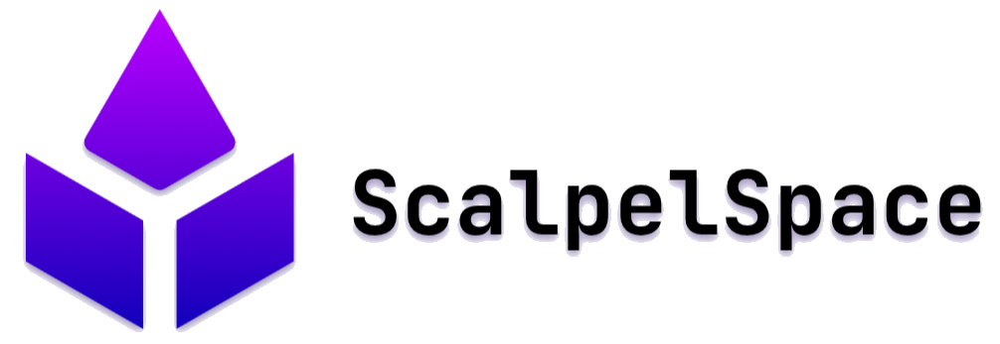

> [!NOTE]
> This current version of the Momentum SDK is missing documentation with Doxy. The project has being tested for building both C++ and Python bindings in an external computer without error.

> [!IMPORTANT]  
> Part of the SDK might be update or simplified later. This project version initiated as internal development, but also thinking in being deliver as an user-friendly interface for customers.

> [!WARNING]  
> Test files for C++ and python bindings were not generated yet. Future work to add.


# Momentum SDK

High-performance C++ SDK with Python bindings for ScalpelSpace Momentum board. It works by creating a high-level interface on top of the momentum_driver files, which handle the low-level CAN bus communication and message parsing. The driver layer takes care of all the messy hardware details such as frame formatting, signal extraction, and protocol compliance. While, the SDK provides clean intuitive methods for accessing sensor data and you can focus on building your project instead of needing to write low-level code for raw CAN and DBC specifications.

## Quick Installation

### Prerequisites
```bash
sudo apt update
```
```bash
sudo apt install build-essential cmake python3 python3-pip python3-dev git
```
```bash
sudo apt-get install -y can-utils iproute2 linux-modules-extra-$(uname -r)
```

# Install Python dependencies for python bindings
```bash
pip3 install --user --upgrade pip setuptools wheel
```
```bash
pip3 install --user cantools pybind11 pybind11-stubgen
```

### If using Waveshare RS485 CAN HAT

```bash
-sudo nano /boot/firmware/config.txt
```
### Add the following:
```bash
dtparam=spi=on
dtoverlay=mcp2515-can0,oscillator=12000000,interrupt=25,spimaxfrequency=2000000
```
```bash
sudo reboot now
```

### Activate can0
```bash
sudo ip link set can0 up type can bitrate 5000000
```

### Cloning the repository
```bash
cd ~
```
```bash
git clone https://github.com/scalpelspace/momentum_sdk.git
```

### How to build Momentum SDK C++ files
```bash
cd ~/momentum_sdk

```bash
git submodule update --init --recursive
```

```
```bash
mkdir build && cd build
```
```bash
cmake ..
```
```bash
make -j$(nproc)
```

### Python Bindings with automatic sub generation for VS Code Intellisense

```bash
pip3 install --user .
```

## Usage

### C++
```cpp
#include "momentum_sdk/momentum_sdk.hpp"

MomentumSDK::MomentumConfig config;
config.can_interface = "can0";
MomentumSDK::Momentum momentum(config);
momentum.connect();

// Example for use get methods for IMU sensor, but you can access as well
//Barometric sensor, GPS sensor and System State(RTC and Status).
auto imu_data = momentum.getImuData();

if (imu_data.has_value()) {
    
    // To access IMU data structure
    const auto& imu = imu_data.value();
    
    // Print accelerometer data for example
    std::cout << "Accelerometer: (" 
              << imu.Accel_x << ", "
              << imu.Accel_y << ", "
              << imu.Accel_z << ") m/s^2" << std::endl;

    /**IMU Data structure contain more type such as Gyro, Linear Accel, 
    Quaternions and Gravity. For full example check momentum_sdk/examples/momentum_cpp**/
}
```

### Python
```python
import momentum_sdk as momentum

config = momentum.MomentumConfig()
config.can_interface = "can0"
m = momentum.Momentum(config)
m.connect()

# Get sensor data
imu = m.get_imu_data()

if imu:
    accel = imu.accel
    gyro = imu.gyro
    print(f"Accelerometer: ({accel[0]:.3f}, {accel[1]:.3f}, {accel[2]:.3f})")
    print(f"Gyroscope: ({gyro[0]:.3f}, {gyro[1]:.3f}, {gyro[2]:.3f})")
```

## DBC Integration
The SDK automatically uses DBC signal definitions from momentum_driver for:
- Accurate scaling and offset application
- Signal validation and range checking  
- Consistent data interpretation
- Easy maintenance when protocols change


